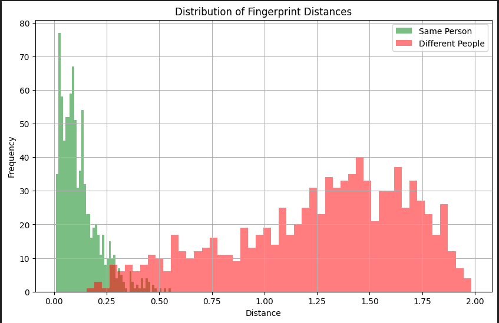

# Fingerprint Identification System

A full-stack project for fingerprint recognition using deep learning and Flask. It includes:

- A **PyTorch Siamese neural network** with attention mechanisms for fingerprint embedding
- A **Flask web application** for employee registration and verification
- **SQLite database** to store fingerprint embeddings
- Utility scripts for **model training**, **evaluation**, and **visualization**

---

## Table of Contents

- [Features](#-features)
- [Architecture](#-architecture)
- [Setup & Installation](#-setup--installation)
- [Training the Model](#-training-the-model)
- [Running the Web App](#-running-the-web-app)
- [Usage](#-usage)
- [File Descriptions](#-file-descriptions)
- [Model Details](#-model-details)
- [Visualization Tools](#-visualization-tools)
- [Training Results](#-training-results)
- [Dependencies](#-dependencies)
- [Credits](#-credits)
- [License](#-license)

---

## Features

- Siamese network with **triplet loss** and **attention modules**
- **Hard triplet mining** and **K-Fold cross-validation**
- Fingerprint **preprocessing, training, and ROC analysis**
- Web interface for **employee registration and live fingerprint verification**
- Automatic storage of embeddings in a **SQLite database**
- Visual tools: t-SNE, ROC curve, training plots

---

## Architecture

**Model Training Pipeline**
- Loads and processes fingerprint BMP images
- Trains a Siamese network using Triplet Loss
- Mines hard triplets to improve convergence
- Visualizes accuracy, loss, and embeddings

**Web Application**
- Registers fingerprints via a simple web interface
- Converts uploaded images to embeddings
- Stores name and embedding in a local database
- (Optional) Verifies fingerprints against registered embeddings

---

## Setup & Installation

```bash
git clone https://github.com/yourusername/fingerprint-id.git
cd fingerprint-id

```bash
pip install torch torchvision flask scikit-learn matplotlib tqdm pillow
```

---

## Training the Model

```bash
python FingerPrint_Identification_Model_Training.py
```

This script:
- Filters `Right_index_finger` BMPs from SOCOFing
- Builds a triplet dataset
- Trains the Siamese model with triplet loss
- Visualizes and evaluates performance

---

## Running the Web App

```bash
python FPI_APP.py
```

Visit: `http://localhost:5100`

Routes:
- `/`: Homepage
- `/register`: Upload fingerprint + name

---

## Usage

1. Navigate to `/register`
2. Upload fingerprint image and enter name
3. Submits image, embeds fingerprint, stores in database

---

## File Descriptions

| File | Description |
|------|-------------|
| `FingerPrint_Identification_Model_Training.py` | Model training and evaluation |
| `FPI_APP.py` | Flask web interface |
| `uploads/` | Runtime folder for fingerprint images |
| `fingerprints.db` | SQLite database with embeddings |
| `templates/` | HTML templates (auto-generated) |

---

## Model Details

- Architecture: Siamese + Attention (Channel & Spatial)
- Loss: Triplet Loss (margin=0.6)
- Optimizer: Adam
- Input: 96x96 grayscale BMP
- Output: 128-D normalized embeddings

---

## Visualization Tools

<figure>
  
  <figcaption><strong>Training History:</strong> Loss and Accuracy curves over 15 epochs</figcaption>
</figure>

<figure>
  
  <figcaption><strong>ROC Curve:</strong> AUC ≈ 0.9975 indicates excellent separability</figcaption>
</figure>

<figure>
  
  <figcaption><strong>Distance Distribution:</strong> Positive vs Negative pairs in embedding space</figcaption>
</figure>

<figure>
  
  <figcaption><strong>t-SNE Plot:</strong> Visual clustering of fingerprint embeddings</figcaption>
</figure>

---

## Training Results

**Best Epoch Summary:**
- Final Validation Accuracy: **0.9978**
- Best Validation Accuracy Achieved: **1.0000**
- Early Stopping Triggered after Epoch 15

| Epoch | Train Loss | Train Acc | Val Loss | Val Acc |
|-------|------------|-----------|----------|---------|
| 1     | 0.4567     | 0.6660    | 0.1868   | 0.9544  |
| 2     | 0.2968     | 0.7952    | 0.0363   | 0.9933  |
| 3     | 0.2053     | 0.8762    | 0.0235   | 1.0000  |
| ...   | ...        | ...       | ...      | ...     |
| 14    | 0.1069     | 0.9500    | 0.0201   | 0.9989  |
| 15    | 0.1085     | 0.9486    | 0.0195   | 0.9978  |

---

## Dependencies

- Python 3.8+
- PyTorch & torchvision
- Flask
- SQLite3
- scikit-learn
- tqdm
- Pillow
- matplotlib

---

## Credits

- Dataset: [SOCOFing](https://www.kaggle.com/datasets/mesutpiskin/fingerprint-dataset)
- Inspired by: FaceNet, signature verification methods

---
